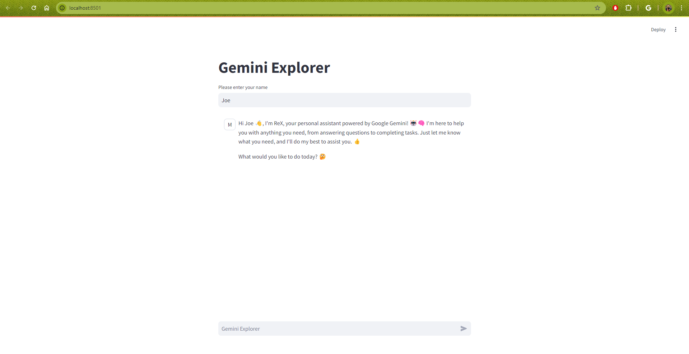

# gemini-demo
A simple webapp that makes it easy to interact with Gemini Pro

---
## Requirements
- Python 3.8+
- GCP Account
- Google Cloud SDK
- `pip install streamlit vertexai`

## To run
- `streamlit run gemini_explorer.py`
- *Note that the Streamlit exposes port 8501*

## Illustration

&nbsp;  
&nbsp;  

